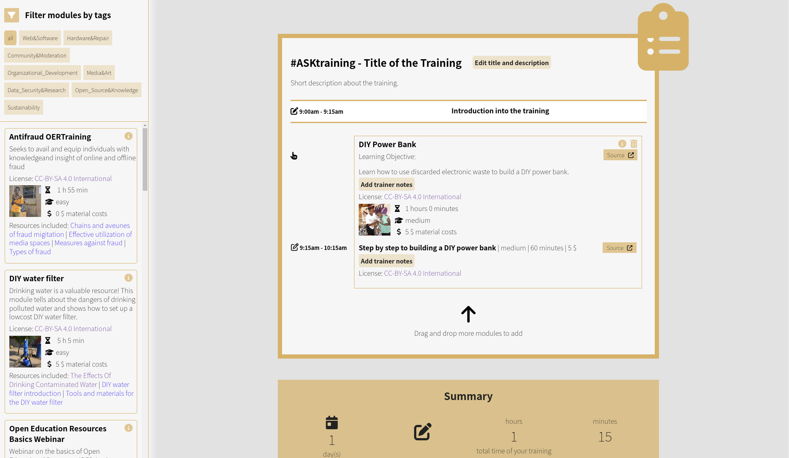

# #ASKtraining training plan

With the #ASKnet training plan you can compile and plan your individual training. You can choose from the different training modules and freely organize the schedule for your training. The training plan automatically creates a schedule with recommended breaks, which are then individually adjusted.



Afterwards, the training plan shows which resources are needed, how high the material costs are, how high the recommended number of participants should be and how many trainers are needed.

You can also add helpful attachments to your training plan, such as a timetable, material checklists, and more. Your individual training plan is ready, which you can then download as a PDF package to share or print out.

## --===<({   [Demo](https://asktraining.github.io/Training/)   })>===--

## Table of Contents

- [Documentation](#documentation)
- [Developer](#developer)
  - [Folder structure](#folder-structure)
  - [Requirements](#requirements)
  - [Setting up locally](#setting-up-and-running-locally)
  - [Styling](#styling)
    - [Compiling CSS from SASS](#compiling-css-from-sass)
    - [Other CSS libraries](#other-css-libraries)
  - [Contributing](#contributing)
- [Partners and Funder](#partners-and-funder)
- [License](#license)

## Documentation

All information on how to use the training plan, install it or create additional modules can be found in the [documentation](https://github.com/ASKnetCommunity/OER_documents_template/wiki/%23ASKtraining-Integration).

## Developer

Here you can see the [concept paper](https://md.bmen.cc/training-generator)

### Folder structure

```markdown
.
├── 404.html
├── assets                                      # JS, CSS, fonts, and image assets
│   ├── css                                     # Autogenerated CSS. DO NOT EDIT MANUALLY
│   ├── fonts                                   # font styles
│   ├── img                                     # image assets
│   │   ├── modules                             # module images
│   └── js                                      # JavaScript files - edit JS files from here
├── _config.yml                                 # Jekyll config
├── _data
├── docker-compose.yml                          # docker config
├── Gemfile                                     # external modules/packages
├── Gemfile.lock
├── _includes                                   # Jekyll [Includes directory](https://jekyllrb.com/docs/includes/)
├── index.html
├── _layouts                                    # Jekyll [Layouts directory](https://jekyllrb.com/docs/layouts/)
│   └── trainingsplan.html                      # Training plan layout
├── LICENSE.md
├── _modules                                    # Training modules
├── README.md
├── _resources                                  # Training resources
├── _sass                                       # SASS files. Do your styling here
├── _site                                       # Autogenerated static site. DO NOT EDIT MANUALLY
├── training.html
└── training.yml
```

### Requirements

- **docker >~ v.20.10.3**: [Docker](https://www.docker.com/) for running the app in a container
- **docker-compose >~ v.1.27.4**: [Docker Compose](https://docs.docker.com/compose/) for defining the docker configuration and running the app
- **Internet connection**

### Setting up and running locally

To start the app initially:

- Open [Gemfile](/Gemfile) and add the following (This is only a temporary adjustment for local instance development! DO NOT COMMIT TO MAIN BRANCH!)

```ruby
gem "webrick"
```

- Start the app with

```bash
docker compose up
```

Go to your browser and type `http://0.0.0.0:4000`

To stop the app:

```bash
docker compose stop
```

To run the app in detached mode(run in the background):

```bash
docker compose up -d
```

After the initial start, you can start with the following command without an internet connection:

```bash
docker compose start
```

Docker Compose manual:

```bash
docker compose man
docker compose --help # same as docker compose man
# Use docker compose COMMAND --help to get additional information on a command e.g.
docker compose up --help # to get additional information on the `up` command
```

### Styling

All styling changes are made in the **Sass files** in the [_sass](/_sass/) folder. The `min.css` and `min.css.map` files (target) will be compiled automaticly from the Sass files (source). You can find more information about the Sass syntax [here](https://sass-lang.com/documentation/syntax/).

#### Compiling CSS from Sass

**Important:** You need a Sass compiler for this! If you use [VSCodium](https://vscodium.com/)/[VSCode](https://code.visualstudio.com/) as your IDE, you can use the plugin [Live Sass Compiler
](https://github.com/glenn2223/vscode-live-sass-compiler).

The following settings in the plugin are recommended:

```json
"liveSassCompile.settings.formats": [
    {
        "format": "compressed",
        "extensionName": ".min.css",
        "savePath": "assets/css/",
        "savePathReplacementPairs": null
    }
],
```

You can find the documentation for the `Live Sass Compiler` [here](https://github.com/glenn2223/vscode-live-sass-compiler/blob/master/docs/settings.md) including instructions for how to change the extension's settings.

#### Other CSS libraries

CSS libraries from other sources are saved directly in the [/assets/css](/assets//css/) folder as `*.min.css` and `*.min.css.map`. To do this, please enter the version number of the library in the file name in the following format.

Example: `bootstrap-5.3.2.min.css`

The library must then be integrated either in a layout file in the [/_layouts](/_layouts/) directory or in [main.sass](/_sass//main.sass).

### Contributing

Contributions are more than welcome! Please check out the [contributing guide](CONTRIBUTING.md).

## Partners and Funder

| r0g Agency | ASKnet  | BMZ |
| :--------: | :----: | :-------: |
|[](https://openculture.agency/)|[](https://github.com/ASKnet-Open-Training)|  [](https://www.bmz.de/en/) |
| [Official Website](https://openculture.agency/) | [Official Website](https://github.com/ASKnet-Open-Training) | [Official Website](https://www.bmz.de/en/) |

## License

<a rel="license" href="http://creativecommons.org/licenses/by-sa/4.0/"></a><br />All content is licensed under a <a rel="license" href="http://creativecommons.org/licenses/by-sa/4.0/">Creative Commons Attribution-ShareAlike 4.0 International License</a>.

The Configurator Software is licensed under a GPLv3 License (see LICENSE.md File)

First prototype developed by [NanoLogika](https://www.nanologika.de)

[](https://www.nanologika.de)
